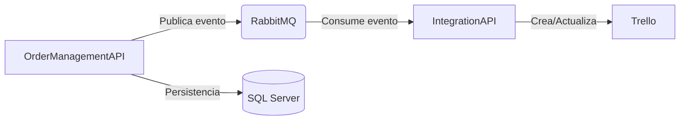

# Order Management System con integración Trello

Este proyecto consiste en un sistema basado en **microservicios** compuesto por:

- **OrderManagementAPI** → expone endpoints para crear y actualizar órdenes.  
- **IntegrationAPI** → escucha eventos en RabbitMQ y crea/actualiza tarjetas en Trello.  
- **RabbitMQ** → utilizado como *message broker*.  
- **SQL Server** → persistencia de datos para las órdenes.  

---

## 📐 Arquitectura elegida y razones

- Cada API tiene su propio ciclo de vida, base de datos y responsabilidades claras.  
- RabbitMQ permite comunicación asíncrona y confiable entre servicios.  
- SQL Server asegura persistencia transaccional de las órdenes.  
- Trello se utiliza como integración externa para gestión visual de las órdenes.  



---

## 🧩 Principios SOLID aplicados

- **S (Single Responsibility)**  
  - `OrderController` → solo maneja endpoints.  
  - `OrderService` → encapsula la lógica de negocio de órdenes.  
  - `RabbitMqService` → gestiona exclusivamente la comunicación con RabbitMQ.  

- **O (Open/Closed)**  
  - Los servicios pueden extenderse (ej. nuevos *publishers* para más colas) sin modificar las clases existentes.  

- **L (Liskov Substitution)**  
  - Interfaces como `IRabbitMqService` permiten usar implementaciones reales o *mocks* en testing.  

- **I (Interface Segregation)**  
  - Cada servicio define contratos mínimos (`IOrderService`, `IRabbitMqService`), evitando dependencias innecesarias.  

- **D (Dependency Inversion)**  
  - Se utilizan dependencias inyectadas vía constructor usando **DI de .NET**, desacoplando las implementaciones concretas.  

---

## 🏗️ Patrones de diseño utilizados

- **DDD (Domain-Driven Design)**  
  - Arquitectura basada en el dominio, que permite segregar de manera clara y eficiente los proyectos.  

- **Publisher/Subscriber (con RabbitMQ)**  
  - **OrderManagementAPI** publica eventos en RabbitMQ.  
  - **IntegrationAPI** se suscribe y procesa los mensajes.  

---

## 🚀 Ejecución del proyecto

### Requisitos previos
- Docker y Docker Compose instalados.
- Claves y tokens de Trello configurados en `IntegrationAPI`.

### Pasos
1. Clonar el repositorio.  
2. Ejecutar el comando:  

   ```bash
   docker compose up --build
   ```

   Esto levantará los siguientes contenedores:
   - **OrderManagementAPI**
   - **SQL Server**
   - **RabbitMQ**
   - **IntegrationAPI**

3. Una vez levantados los contenedores, el API estará disponible en:  
   👉 [http://localhost:5000/swagger/index.html](http://localhost:5000/swagger/index.html)

---

## 📝 Notas adicionales

- Es necesario agregar las variables necesarias para la conexión con Trello en `IntegrationAPI`.  
- Actualmente solo está implementada la creación de tarjetas en Trello al generar una nueva orden.  
- Al levantar los contenedores con Docker se ejecutan automáticamente las migraciones que:  
  - Crean la base de datos y tablas.  
  - Insertan 3 productos de ejemplo en la tabla `Product`.  
